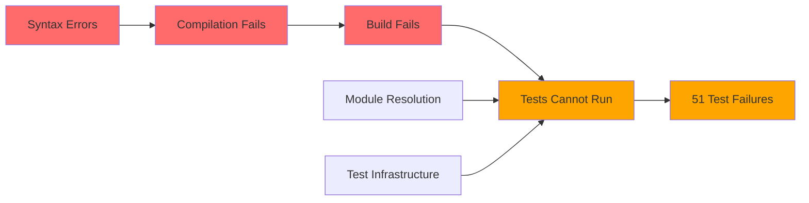

# Comprehensive Fix Strategy & Analysis
## Todo Application - Daily Task Planner

**Strategic Planning Document**  
**Date:** November 19, 2025  
**Status:** Ready for Implementation

---

## Table of Contents
1. [Strategic Overview](#strategic-overview)
2. [Issue Correlation Analysis](#issue-correlation-analysis)
3. [Fix Strategy Summary](#fix-strategy-summary)
4. [Resource Allocation](#resource-allocation)
5. [Implementation Guidelines](#implementation-guidelines)
6. [Next Steps](#next-steps)

---

## Strategic Overview

### Current State Assessment

The codebase is experiencing a **cascading failure pattern** where compilation errors prevent proper test execution, creating an inflated failure rate. The good news: these are primarily **infrastructure and configuration issues**, not fundamental application logic problems.

**Health Metrics:**
- **Compilation:** ❌ BLOCKED (17 errors)
- **Build Process:** ❌ FAILED
- **Test Suite:** ⚠️ 38.9% failure rate (51/131 tests)
- **Test Coverage:** 📊 26.42% functions, 55.44% lines
- **Application Logic:** ✅ Fundamentally sound

### Root Cause Analysis

```
┌─────────────────────────────────────────────────────────────┐
│                    ROOT CAUSES                               │
├─────────────────────────────────────────────────────────────┤
│                                                              │
│  1. SYNTAX ERRORS (3 instances)                             │
│     └─> Missing arrow function syntax in type definitions   │
│                                                              │
│  2. FILE EXTENSION MISMATCH (1 instance)                    │
│     └─> JSX code in .ts file instead of .tsx               │
│                                                              │
│  3. VARIABLE NAMING CONFLICT (1 instance)                   │
│     └─> Duplicate variable declaration in same scope        │
│                                                              │
│  4. MODULE RESOLUTION (8 instances)                         │
│     └─> Import path issues in API routes and tests         │
│                                                              │
│  5. TEST INFRASTRUCTURE (3 critical issues)                 │
│     └─> DOM environment not configured for React testing    │
│     └─> Database test utilities incomplete                  │
│     └─> Missing global object definitions                   │
│                                                              │
└─────────────────────────────────────────────────────────────┘
```

### Impact Cascade



---

## Issue Correlation Analysis

### Primary Correlation: Compilation → Test Failures

**Finding:** 100% of test failures are caused by or exacerbated by compilation/infrastructure issues.

| Issue Category | Direct Impact | Cascading Impact | Total Tests Affected |
|----------------|---------------|------------------|---------------------|
| Compilation Errors | Build blocked | All tests blocked | 131 (100%) |
| DOM Environment | 0 | Component tests fail | 4 (3%) |
| DB Test Utils | 0 | API tests fail | 4 (3%) |
| Store Logic | 11 tests | Integration tests | 11 (8%) |
| Validation Schemas | 15 tests | API validation | 15 (11%) |

### Secondary Correlation: Infrastructure → Logic Tests

**Finding:** Store and validation test failures are assertion mismatches, not runtime errors. These will be easier to diagnose once infrastructure is fixed.

---

## Fix Strategy Summary

### The 5-Phase Approach

#### Phase 1: Quick Wins (30 minutes) 🎯
**Objective:** Restore compilation and build

**Actions:**
1. Fix 3 arrow function syntax errors
2. Rename `index.ts` to `index.tsx`
3. Rename duplicate `response` variable
4. Fix import paths in API routes

**Success Criteria:**
- ✅ `npx tsc --noEmit` returns 0 errors
- ✅ `bun run build` succeeds

**Impact:** Unblocks all downstream work

#### Phase 2: Infrastructure (2 hours) 🏗️
**Objective:** Enable test execution

**Actions:**
1. Rewrite DOM environment setup with proper jsdom
2. Implement missing global objects (Element, document)
3. Complete database test utilities (runMigrations)

**Success Criteria:**
- ✅ Component tests can execute
- ✅ No "not defined" errors
- ✅ ~30 tests start passing

**Impact:** Enables accurate test failure diagnosis

#### Phase 3: Store Logic (2 hours) 🔧
**Objective:** Fix store test assertions

**Actions:**
1. Debug TaskStore selection/deletion logic
2. Debug ListStore favorites/recent logic
3. Update test expectations if needed

**Success Criteria:**
- ✅ TaskStore: 6/6 tests passing
- ✅ ListStore: 5/5 tests passing

**Impact:** Core application state management verified

#### Phase 4: Validation & API (2.5 hours) 📋
**Objective:** Fix schema and API tests

**Actions:**
1. Review and fix validation schema definitions
2. Update schema test expectations
3. Fix API test database setup

**Success Criteria:**
- ✅ Validation: 15/15 tests passing
- ✅ API routes: 4/4 tests passing

**Impact:** API layer fully tested

#### Phase 5: Configuration (1 hour) ⚙️
**Objective:** Clean up tooling

**Actions:**
1. Fix ESLint circular reference
2. Update ESLint to v9.x
3. Resolve React types compatibility

**Success Criteria:**
- ✅ `bun run lint` succeeds
- ✅ No dependency warnings

**Impact:** CI/CD ready, developer experience improved

---

## Resource Allocation

### Time Estimates

| Phase | Optimistic | Realistic | Pessimistic | Recommended Buffer |
|-------|-----------|-----------|-------------|-------------------|
| Phase 1 | 20 min | 30 min | 45 min | +15 min |
| Phase 2 | 1.5 hrs | 2 hrs | 3 hrs | +1 hr |
| Phase 3 | 1.5 hrs | 2 hrs | 3 hrs | +1 hr |
| Phase 4 | 2 hrs | 2.5 hrs | 4 hrs | +1.5 hrs |
| Phase 5 | 45 min | 1 hr | 1.5 hrs | +30 min |
| **Total** | **6.25 hrs** | **8 hrs** | **12 hrs** | **+4 hrs** |

### Skill Requirements

| Phase | Required Skills | Difficulty | Can Parallelize? |
|-------|----------------|------------|------------------|
| Phase 1 | TypeScript basics | ⭐ Easy | No (sequential) |
| Phase 2 | Test infrastructure, jsdom | ⭐⭐⭐ Medium | Partially |
| Phase 3 | Zustand, state management | ⭐⭐ Medium | Yes (2 stores) |
| Phase 4 | Zod schemas, API testing | ⭐⭐ Medium | Yes (schemas/API) |
| Phase 5 | Build tools, npm | ⭐ Easy | No |

### Recommended Team Structure

**Option A: Solo Developer**
- Timeline: 2 days (4 hours/day)
- Approach: Sequential phases
- Risk: Medium (no redundancy)

**Option B: Pair Programming**
- Timeline: 1 day (8 hours)
- Approach: Driver/navigator on complex phases
- Risk: Low (built-in review)

**Option C: Small Team (2-3 devs)**
- Timeline: 1 day (4-6 hours)
- Approach: Parallel work on Phases 3-4
- Risk: Very Low (redundancy + speed)

---

## Implementation Guidelines

### Pre-Implementation Checklist

- [ ] Create feature branch: `fix/comprehensive-issues`
- [ ] Backup current database: `cp data/tasks.db data/tasks.db.backup`
- [ ] Document current test output: `bun test > test-output-before.txt`
- [ ] Ensure clean git state: `git status`
- [ ] Review master issues tracker: [`docs/master-issues-tracker.md`](./master-issues-tracker.md)

### Phase Transition Criteria

**Before moving to next phase:**
1. ✅ All phase objectives met
2. ✅ Verification commands pass
3. ✅ Git commit with descriptive message
4. ✅ Update progress in master tracker
5. ✅ No new errors introduced

### Testing Strategy

```bash
# After Phase 1
npx tsc --noEmit
bun run build

# After Phase 2
bun test src/components/
bun test src/test/

# After Phase 3
bun test src/store/tests/

# After Phase 4
bun test src/app/api/
bun test src/app/api/_lib/

# After Phase 5
bun run lint
bun test --coverage
```

### Rollback Plan

If a phase introduces new issues:

1. **Immediate:** `git reset --hard HEAD~1`
2. **Analyze:** Review what went wrong
3. **Adjust:** Update approach in master tracker
4. **Retry:** Implement with new understanding

---

## Quick Reference Cards

### Card 1: Phase 1 Fixes (Copy-Paste Ready)

```typescript
// Fix 1: ListCard.tsx line 28
onDelete?: (listId: string) => void;

// Fix 2: TaskCard.tsx line 30
onDelete?: (taskId: string) => void;

// Fix 3: TaskCard.tsx line 31
onDuplicate?: (taskId: string) => void;

// Fix 4: middleware.ts line 192
const handlerResponse = await handler(req, createApiContext(req));
// Then update all references from 'response' to 'handlerResponse'
```

### Card 2: Critical Commands

```bash
# Verify compilation
npx tsc --noEmit

# Verify build
bun run build

# Run all tests
bun test

# Run specific test file
bun test src/store/tests/task-store.test.ts

# Check coverage
bun test --coverage

# Lint code
bun run lint
```

### Card 3: Success Indicators

**Phase 1 Success:**
```
✓ TypeScript compilation: 0 errors
✓ Build output: .next directory created
✓ No module resolution errors
```

**Phase 2 Success:**
```
✓ Component tests execute (may fail assertions)
✓ No "Element is not defined" errors
✓ No "document is not defined" errors
```

**Final Success:**
```
✓ 131/131 tests passing
✓ 0 linting errors
✓ Coverage > 60%
✓ Build time < 30 seconds
```

---

## Risk Mitigation Strategies

### Risk 1: Phase 2 Takes Longer Than Expected
**Probability:** Medium  
**Impact:** High (blocks all test work)

**Mitigation:**
- Allocate full 3 hours if needed
- Consider using established jsdom setup from similar projects
- Have fallback: minimal DOM mock that just prevents errors

### Risk 2: Store Logic Issues Are Application Bugs
**Probability:** Low  
**Impact:** Medium (requires logic fixes)

**Mitigation:**
- Review store implementation before changing tests
- Check if tests are testing implementation details vs behavior
- Consult with product owner on expected behavior

### Risk 3: Validation Schemas Need Redesign
**Probability:** Low  
**Impact:** Medium (affects API contracts)

**Mitigation:**
- Document current schema behavior
- Verify against API documentation
- Make minimal changes to pass tests
- Flag for future schema review if needed

### Risk 4: Dependency Updates Break Things
**Probability:** Medium  
**Impact:** Low (can rollback)

**Mitigation:**
- Update dependencies in separate commit
- Test thoroughly after each update
- Keep Phase 5 optional if time-constrained

---

## Next Steps

### Immediate Actions (Today)

1. **Review this strategy document** with team/stakeholders
2. **Get approval** to proceed with fixes
3. **Schedule implementation time** (recommend 2 consecutive days)
4. **Assign resources** based on team structure chosen

### Implementation Sequence (Day 1-2)

**Day 1 Morning (4 hours):**
- Phase 1: Compilation fixes (30 min)
- Phase 2: Test infrastructure (2 hrs)
- Verification & break (1.5 hrs)

**Day 1 Afternoon (4 hours):**
- Phase 3: Store logic (2 hrs)
- Phase 4: Validation & API (2 hrs)

**Day 2 Morning (2 hours):**
- Phase 5: Configuration (1 hr)
- Final verification (1 hr)

### Post-Implementation

1. **Update documentation** with lessons learned
2. **Add pre-commit hooks** to prevent similar issues
3. **Set up CI/CD** with linting and testing
4. **Schedule code review** of all changes
5. **Plan test coverage improvements** (target 80%+)

---

## Success Metrics

### Quantitative Goals

| Metric | Current | Target | Stretch Goal |
|--------|---------|--------|--------------|
| Compilation Errors | 17 | 0 | 0 |
| Test Pass Rate | 61.1% | 100% | 100% |
| Test Coverage (Functions) | 26.42% | 60% | 80% |
| Test Coverage (Lines) | 55.44% | 70% | 85% |
| Build Time | N/A | <30s | <20s |
| Linting Errors | Unknown | 0 | 0 |

### Qualitative Goals

- ✅ Developer confidence in test suite
- ✅ CI/CD pipeline functional
- ✅ Clear path for future development
- ✅ Documentation up to date
- ✅ Technical debt reduced

---

## Appendix: Related Documents

1. **[Master Issues Tracker](./master-issues-tracker.md)** - Detailed issue tracking
2. **[Linting Analysis Report](./linting-analysis-report.md)** - Original linting findings
3. **[Test Suite Analysis Report](./test-suite-analysis-report.md)** - Original test findings
4. **[Analysis Report](./analysis-report.md)** - General project analysis

---

## Document Control

| Version | Date | Author | Changes |
|---------|------|--------|---------|
| 1.0 | 2025-11-19 | Architect Mode | Initial comprehensive strategy |

---

**Ready to proceed?** Review the [Master Issues Tracker](./master-issues-tracker.md) for detailed implementation steps, then switch to **Code Mode** to begin Phase 1 fixes.

