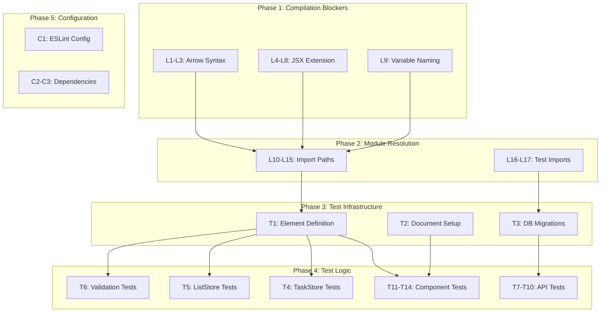

# Master Issues Tracker & Strategic Fix Plan
## Todo Application - Daily Task Planner

**Created:** November 19, 2025  
**Status:** Planning Phase  
**Total Issues:** 68 (17 linting + 51 test failures)

---

## Executive Summary

This document provides a comprehensive categorization and prioritized fix strategy for all discovered issues in the codebase. The issues are interconnected—linting/compilation errors directly cause test failures, creating a cascading failure pattern that must be addressed systematically.

**Key Metrics:**
- **Linting Errors:** 17 critical (blocking compilation)
- **Test Failures:** 51 of 131 tests (38.9% failure rate)
- **Files Requiring Fixes:** 15+ files
- **Estimated Total Effort:** 8-12 hours

---

## Issue Categorization Matrix

### Category 1: Compilation Blockers (CRITICAL)
| ID | Issue | File | Line | Type | Effort | Risk |
|----|-------|------|------|------|--------|------|
| L1 | Missing `=>` in function type | [`ListCard.tsx`](../src/components/lists/ListCard.tsx:28) | 28 | Syntax | 1 min | Low |
| L2 | Missing `=>` in function type | [`TaskCard.tsx`](../src/components/tasks/TaskCard.tsx:30) | 30 | Syntax | 1 min | Low |
| L3 | Missing `=>` in function type | [`TaskCard.tsx`](../src/components/tasks/TaskCard.tsx:31) | 31 | Syntax | 1 min | Low |
| L4-8 | JSX in .ts file | [`src/store/index.ts`](../src/store/index.ts:295) | 295-299 | Extension | 5 min | Low |
| L9 | Duplicate variable `response` | [`middleware.ts`](../src/app/api/_lib/middleware.ts:167) | 167, 192 | Naming | 2 min | Low |

**Subtotal:** 9 errors, ~10 minutes effort

### Category 2: Module Resolution Errors (HIGH)
| ID | Issue | File | Type | Effort | Risk |
|----|-------|------|------|--------|------|
| L10-12 | Missing import paths | [`files/[id]/route.ts`](../src/app/api/files/[id]/route.ts) | Import | 5 min | Low |
| L13-15 | Missing import paths | [`labels/[id]/route.ts`](../src/app/api/labels/[id]/route.ts) | Import | 5 min | Low |
| L16-17 | Module not found | [`integration.test.ts`](../src/store/tests/integration.test.ts:7) | Import | 10 min | Medium |

**Subtotal:** 8 errors, ~20 minutes effort

### Category 3: Test Infrastructure Failures (CRITICAL)
| ID | Issue | File | Type | Effort | Risk |
|----|-------|------|------|--------|------|
| T1 | Element not defined | [`dom-setup.ts`](../src/test/dom-setup.ts:336) | Environment | 30 min | Medium |
| T2 | document not defined | Multiple component tests | Environment | 30 min | Medium |
| T3 | Missing runMigrations | [`test-utils.ts`](../src/lib/db/test-utils.ts) | Implementation | 45 min | Medium |

**Subtotal:** 3 infrastructure issues, ~1.75 hours effort

### Category 4: Store Logic Test Failures (HIGH)
| ID | Issue | Test Suite | Failures | Type | Effort | Risk |
|----|-------|------------|----------|------|--------|------|
| T4 | TaskStore assertions | [`task-store.test.ts`](../src/store/tests/task-store.test.ts) | 6 | Logic | 1 hour | Medium |
| T5 | ListStore assertions | [`list-store.test.ts`](../src/store/tests/list-store.test.ts) | 5 | Logic | 1 hour | Medium |

**Subtotal:** 11 test failures, ~2 hours effort

### Category 5: Validation Schema Failures (MEDIUM)
| ID | Issue | Test Suite | Failures | Type | Effort | Risk |
|----|-------|------------|----------|------|--------|------|
| T6 | Schema logic errors | [`validation.test.ts`](../src/app/api/_lib/validation.test.ts) | 15 | Logic | 2 hours | Low |

**Subtotal:** 15 test failures, ~2 hours effort

### Category 6: API Route Test Failures (MEDIUM)
| ID | Issue | Test Suite | Failures | Type | Effort | Risk |
|----|-------|------------|----------|------|--------|------|
| T7 | Database migration | [`app-store.test.ts`](../src/store/tests/app-store.test.ts:485) | 1 | DB | 30 min | Medium |
| T8 | Database migration | [`search-api.test.ts`](../src/app/api/tests/search-api.test.ts:37) | 1 | DB | 30 min | Medium |
| T9 | Database migration | [`labels-api.test.ts`](../src/app/api/tests/labels-api.test.ts:37) | 1 | DB | 30 min | Medium |
| T10 | Database migration | [`lists-api.test.ts`](../src/app/api/tests/lists-api.test.ts:37) | 1 | DB | 30 min | Medium |

**Subtotal:** 4 test failures, ~2 hours effort

### Category 7: Component Test Failures (HIGH)
| ID | Issue | Test Suite | Failures | Type | Effort | Risk |
|----|-------|------------|----------|------|--------|------|
| T11 | DOM environment | [`TaskCard.test.tsx`](../src/components/tasks/TaskCard.test.tsx) | 1 | Environment | 15 min | Low |
| T12 | DOM environment | [`TaskForms.test.tsx`](../src/components/forms/TaskForms.test.tsx) | 1 | Environment | 15 min | Low |
| T13 | DOM environment | [`Sidebar.test.tsx`](../src/components/layout/Sidebar.test.tsx) | 1 | Environment | 15 min | Low |
| T14 | DOM environment | [`Header.test.tsx`](../src/components/layout/Header.test.tsx) | 1 | Environment | 15 min | Low |

**Subtotal:** 4 test failures, ~1 hour effort (after T1-T2 fixed)

### Category 8: Configuration Issues (LOW)
| ID | Issue | File | Type | Effort | Risk |
|----|-------|------|------|--------|------|
| C1 | ESLint circular reference | `.eslintrc.json` | Config | 15 min | Low |
| C2 | ESLint version mismatch | `package.json` | Dependency | 30 min | Medium |
| C3 | React types mismatch | `package.json` | Dependency | 15 min | Low |

**Subtotal:** 3 config issues, ~1 hour effort

---

## Dependency Mapping



### Critical Path Dependencies

1. **L1-L9 → L10-L17**: Compilation must succeed before module resolution can be verified
2. **L10-L17 → T1-T3**: All imports must resolve before test infrastructure can initialize
3. **T1-T2 → T11-T14**: DOM environment must be fixed before component tests can run
4. **T3 → T7-T10**: Database utilities must be complete before API tests can run
5. **T1-T3 → T4-T6**: Test infrastructure must work before store/validation tests can pass

---

## Prioritized Fix Strategy

### Phase 1: Quick Wins - Compilation Fixes (30 minutes)
**Goal:** Restore TypeScript compilation

| Priority | Task | Files | Effort | Verification |
|----------|------|-------|--------|--------------|
| 1.1 | Fix arrow function syntax | ListCard.tsx, TaskCard.tsx | 3 min | `npx tsc --noEmit` |
| 1.2 | Rename index.ts to index.tsx | src/store/index.ts | 5 min | `npx tsc --noEmit` |
| 1.3 | Rename duplicate variable | middleware.ts | 2 min | `npx tsc --noEmit` |
| 1.4 | Fix import paths | API route files | 10 min | `bun run build` |

**Expected Outcome:** 0 compilation errors, build succeeds

### Phase 2: Test Infrastructure Repair (2 hours)
**Goal:** Enable test execution

| Priority | Task | Files | Effort | Verification |
|----------|------|-------|--------|--------------|
| 2.1 | Fix DOM environment setup | dom-setup.ts | 45 min | Component tests run |
| 2.2 | Implement jsdom properly | setup.ts | 30 min | No document errors |
| 2.3 | Complete test-utils | test-utils.ts | 45 min | API tests initialize |

**Expected Outcome:** Test infrastructure functional, ~30 tests pass

### Phase 3: Store Logic Fixes (2 hours)
**Goal:** Fix store test assertions

| Priority | Task | Files | Effort | Verification |
|----------|------|-------|--------|--------------|
| 3.1 | Fix TaskStore logic | task-store.ts, test | 1 hour | 6 tests pass |
| 3.2 | Fix ListStore logic | list-store.ts, test | 1 hour | 5 tests pass |

**Expected Outcome:** Store tests pass, ~11 additional tests pass

### Phase 4: Validation & API Fixes (2.5 hours)
**Goal:** Fix schema and API tests

| Priority | Task | Files | Effort | Verification |
|----------|------|-------|--------|--------------|
| 4.1 | Fix validation schemas | validation.ts | 1.5 hours | 15 tests pass |
| 4.2 | Fix API test setup | API test files | 1 hour | 4 tests pass |

**Expected Outcome:** Validation and API tests pass, ~19 additional tests pass

### Phase 5: Configuration Cleanup (1 hour)
**Goal:** Fix tooling configuration

| Priority | Task | Files | Effort | Verification |
|----------|------|-------|--------|--------------|
| 5.1 | Fix ESLint config | .eslintrc.json | 15 min | `bun run lint` |
| 5.2 | Update dependencies | package.json | 30 min | No warnings |
| 5.3 | Verify all tools | - | 15 min | Full CI pass |

**Expected Outcome:** All tooling functional, CI/CD ready

---

## Risk Assessment

### Low Risk Fixes (Safe to implement immediately)
- **L1-L3:** Arrow syntax fixes - trivial, no side effects
- **L4-L8:** File rename - straightforward, update imports
- **L9:** Variable rename - localized change
- **C1:** ESLint config - isolated configuration
- **T6:** Validation schemas - well-defined test expectations

### Medium Risk Fixes (Require careful testing)
- **L10-L17:** Import paths - may affect multiple files
- **T1-T2:** DOM setup - affects all component tests
- **T3:** Database utilities - affects all API tests
- **T4-T5:** Store logic - may reveal application bugs
- **C2:** Dependency updates - potential breaking changes

### High Risk Fixes (Require thorough review)
- **None identified** - all issues are infrastructure/configuration related

---

## Implementation Roadmap

### Day 1: Foundation (4 hours)
```
09:00 - 09:30  Phase 1: Compilation fixes
09:30 - 10:00  Verification: Build succeeds
10:00 - 12:00  Phase 2: Test infrastructure
12:00 - 12:30  Verification: Tests can run
```

### Day 1: Logic Fixes (4 hours)
```
13:00 - 15:00  Phase 3: Store logic fixes
15:00 - 17:00  Phase 4: Validation & API fixes
17:00 - 17:30  Verification: 90%+ tests pass
```

### Day 2: Cleanup (2 hours)
```
09:00 - 10:00  Phase 5: Configuration cleanup
10:00 - 11:00  Final verification & documentation
```

---

## Success Criteria

### Phase 1 Complete
- [ ] `npx tsc --noEmit` returns 0 errors
- [ ] `bun run build` succeeds
- [ ] All imports resolve correctly

### Phase 2 Complete
- [ ] Component tests can execute (may still fail)
- [ ] No "document is not defined" errors
- [ ] No "Element is not defined" errors
- [ ] Database test utilities initialize

### Phase 3 Complete
- [ ] TaskStore tests: 6/6 passing
- [ ] ListStore tests: 5/5 passing

### Phase 4 Complete
- [ ] Validation tests: 15/15 passing
- [ ] API route tests: 4/4 passing

### Phase 5 Complete
- [ ] `bun run lint` succeeds
- [ ] No dependency warnings
- [ ] Test coverage > 60%

### Final Success
- [ ] **131/131 tests passing (100%)**
- [ ] **0 linting errors**
- [ ] **Build succeeds**
- [ ] **All CI checks pass**

---

## Quick Reference: Files to Modify

### Immediate Fixes (Phase 1)
1. [`src/components/lists/ListCard.tsx`](../src/components/lists/ListCard.tsx) - Line 28
2. [`src/components/tasks/TaskCard.tsx`](../src/components/tasks/TaskCard.tsx) - Lines 30, 31
3. [`src/store/index.ts`](../src/store/index.ts) → Rename to `index.tsx`
4. [`src/app/api/_lib/middleware.ts`](../src/app/api/_lib/middleware.ts) - Lines 167, 192
5. [`src/app/api/files/[id]/route.ts`](../src/app/api/files/[id]/route.ts) - Import paths
6. [`src/app/api/labels/[id]/route.ts`](../src/app/api/labels/[id]/route.ts) - Import paths

### Infrastructure Fixes (Phase 2)
7. [`src/test/dom-setup.ts`](../src/test/dom-setup.ts) - Complete rewrite
8. [`src/test/setup.ts`](../src/test/setup.ts) - jsdom integration
9. [`src/lib/db/test-utils.ts`](../src/lib/db/test-utils.ts) - Add runMigrations

### Logic Fixes (Phases 3-4)
10. [`src/store/task-store.ts`](../src/store/task-store.ts) - Store logic
11. [`src/store/list-store.ts`](../src/store/list-store.ts) - Store logic
12. [`src/app/api/_lib/validation.ts`](../src/app/api/_lib/validation.ts) - Schema definitions

### Configuration (Phase 5)
13. `.eslintrc.json` - Fix circular reference
14. `package.json` - Update dependencies

---

## Monitoring & Tracking

### Commands for Verification
```bash
# Phase 1 verification
npx tsc --noEmit
bun run build

# Phase 2-4 verification
bun test

# Phase 5 verification
bun run lint
bun test --coverage
```

### Progress Tracking
Update this section as fixes are implemented:

| Phase | Status | Tests Passing | Date Completed |
|-------|--------|---------------|----------------|
| Phase 1 | ⏳ Pending | - | - |
| Phase 2 | ⏳ Pending | - | - |
| Phase 3 | ⏳ Pending | - | - |
| Phase 4 | ⏳ Pending | - | - |
| Phase 5 | ⏳ Pending | - | - |

---

## Appendix: Detailed Error Messages

### Compilation Errors
```typescript
// L1: ListCard.tsx:28
onDelete?: (listId: string) void;  // Missing =>

// L2-L3: TaskCard.tsx:30-31
onDelete?: (taskId: string) void;   // Missing =>
onDuplicate?: (taskId: string) void; // Missing =>

// L9: middleware.ts:167,192
const { allowed, info, response } = checkRateLimit(req, type);
// ...
const response = await handler(req, createApiContext(req)); // Duplicate
```

### Test Infrastructure Errors
```typescript
// T1: dom-setup.ts:336
ReferenceError: Element is not defined

// T2: Component tests
ReferenceError: document is not defined

// T3: API tests
TypeError: undefined is not an object (evaluating 'testAPI.api.runMigrations')
```

---

*This document serves as the single source of truth for issue tracking and fix planning. Update the Progress Tracking section as fixes are implemented.*
